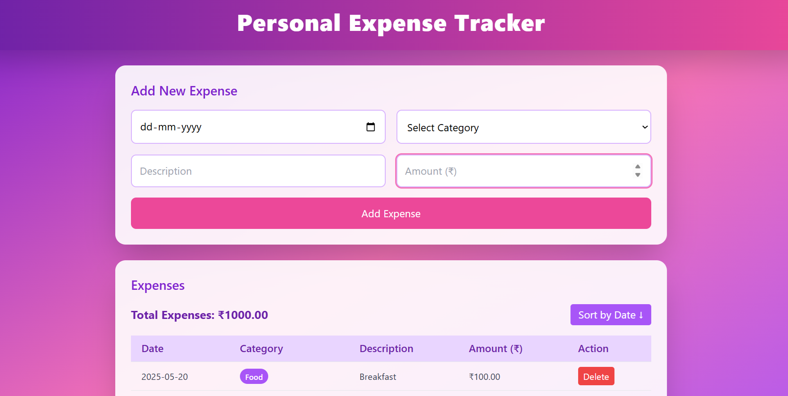
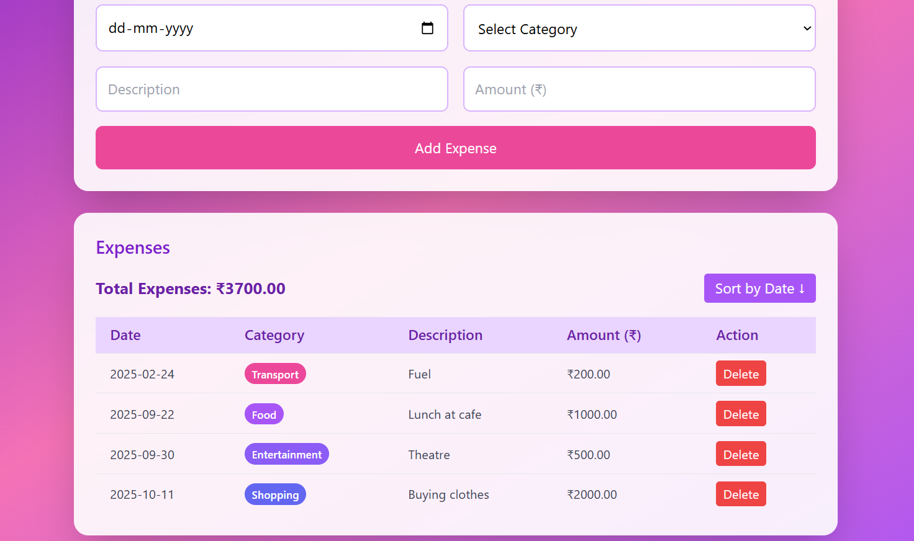
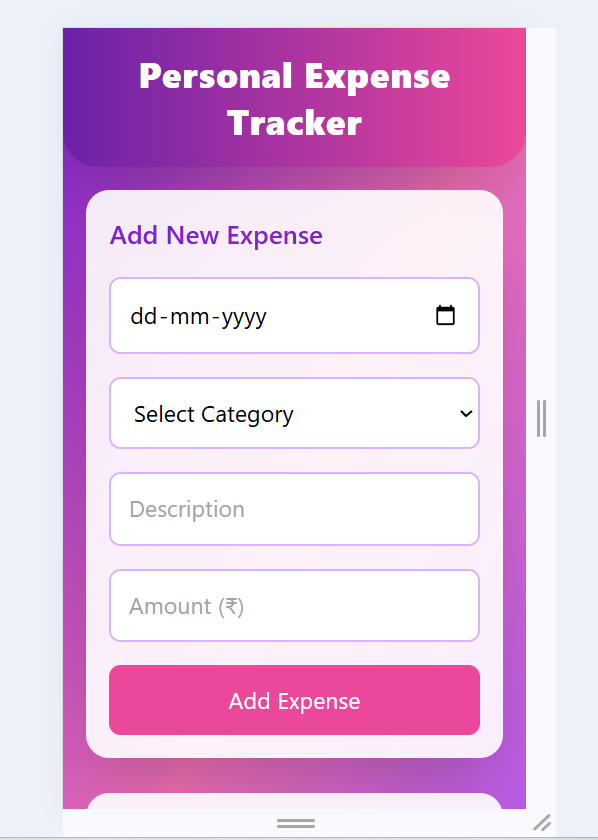

# Personal Expense Tracker

A simple and responsive Expense Tracker web app that helps users track their daily expenses. Built with **HTML, CSS, and JavaScript**, and deployed on **GitHub Pages**.

## Live Demo

[View Live App](https://prethika06.github.io/personal-expense-tracker/)

## Features

* Add and remove expense transactions
* Calculates total expenses automatically
* Sort expenses by date
* Mobile-friendly and responsive layout
* Simple, modern UI with purple & pink theme
* Custom favicon included

## Screenshots

### Home Page

  

### Sorting

  

### Mobile View

  

## Tech Stack

* HTML5
* CSS3 (TailwindCSS)
* JavaScript (ES6+)

## Getting Started

### Run Locally

1. Clone the repository

   ```bash
   git clone https://github.com/Prethika06/personal-expense-tracker.git
   ```

2. Navigate to the folder

   ```bash
   cd personal-expense-tracker
   ```

3. Open `index.html` in your browser

## Folder Structure

* `index.html` – Main HTML page
* `style.css` – Custom styling and layout
* `script.js` – JavaScript logic (add, remove, sort expenses)
* `favicon.png` – Custom app icon
* `screenshots/` – Preview images (mobile & desktop)

## Functionality

* Add expenses with date, category, and description
* Sort expenses by date (ascending/descending)
* Automatically updates the total expense
* Works seamlessly on desktop and mobile

## Credits

Developed by: **Prethika**
No external frameworks used.

